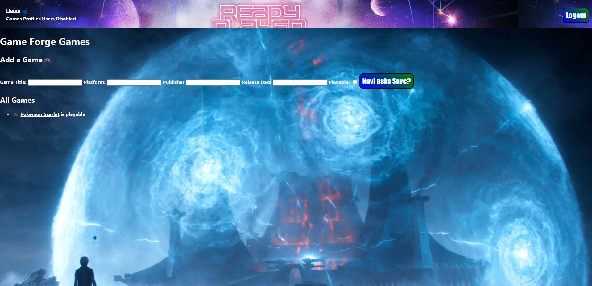

# ***Manny’s Exclusive Gamer Blog*** 
# ***Welcome to GameForge*** 
# (https://gamer-forge.fly.dev/)
# [My prep materials] (https://trello.com/b/rDoMwU9c/unit-2-project-gameforge)

Welcome to my site GameForge,
I wanted to welcome gamers from all genres, platforms, or wherever they may be.
On this site, you can add games you have played, add comments, and meet fellow gamers who share similar interests.
You can view fellow gamers’ profiles, see what games they have played, and share your ideas on them.

# Technologies used thus far are as follows.

- JavaScript,
- CSS Styling ,
- HTML,
- Git,
- EJS,
- imgur,
- Windows Paint,
- DockerFile,
- Mongoose,
- Fly.io
# Credits
While the below disclaimers are technically required by their license-holders I would like to also sincerely thank all the creators whose work makes this site look great. Thank you!
PHOTOGRAPH: DARYADANIK/GETTY IMAGES
# ICEBOX

Planned future enhancements.
- [ ] I plan to enhance the UI and overall style of the site (Aesthetics are always important)
- [ ] Increase the functionality of the site and add more special features (more buttons!!)
- [ ] Mobile Web adaption
- [ ] Accessibility features 
- [ ] Correct the pathing for Profiles and link to list of games
